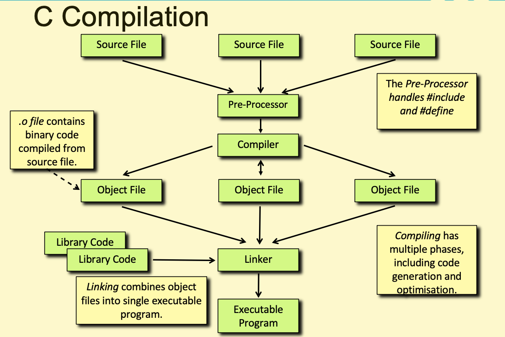

# Week 5

- [Leetcode](#leetcode)
- [C](#c)
- [Miscallaneous](#miscallaneous)

## Leetcode

- [Is Subsequence (Easy)](https://leetcode.com/problems/is-subsequence/)
  - [Python Solution](leetcode_sols/python/leetcode_1_sol.py)
  - [C Solution](leetcode_sols/c/leetcode_1_sol.c)
- [Container With Most Water (Medium)](https://leetcode.com/problems/container-with-most-water/)
  - [Python Solution](leetcode_sols/python/leetcode_2_sol.py)
  - [C Solution](leetcode_sols/c/leetcode_2_sol.c)

## C

- command-line arguments
- ternary operator
  - `<expression> ? <val if true> : <val if false>`
- pre-processor directives
  - macros - `#define <identifier> <token string>`
- bitwise operators
  - `&` - AND
  - `|` - OR
  - `^` - XOR
  - `~` - complement
  - `<<` - left shift
  - `>>` - right shift
  - Remember to use `unsigned` e.g. `unsigned int mask`
  - `1u` - unsigned int 1 literal value
- enums
- header files
  - .h files - public declarations, .c files - private definitions
  - header file should ONLY CONTAIN DECLARATIONS THAT DON'T REQUIRE MEMORY ALLOCATION - so, for example, no const int variable definitions should go into a header file (instead, you could define them in the relevant .c file and declare teh const variables as extern in the .h file OR replace them with #defines)
- how the compiler actually works
  - 

Refer to [c_learning.c](c_learning.c), [add_func.c](add_func.c), and [add_func.h](add_func.h) for explanations and examples.

## Miscallaneous

- Makefiles
  - Refer to the [Makefile](Makefile) in this directory

<!-- ## Sketches

For the diagrams drawn during the session, refer to [this pdf](sketches.pdf). -->
